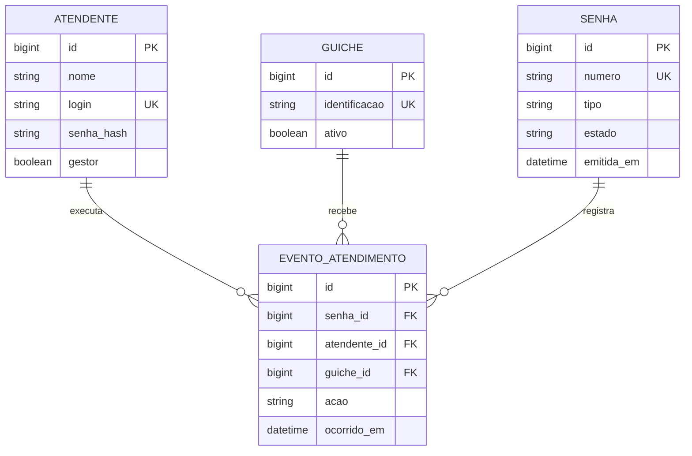

# MER inicial — proposta para revisão com backend

Não há banco implementado. Validar este modelo com a equipe, inclusive estratégia de sequência diária, autorização e auditoria.

Cliente permanece anônimo. Eventos propostos: chamada, segunda chamada, início, fim, ausência e descarte. Evento automático de descarte pode não ter atendente/guichê. A restrição de único gestor e o algoritmo atômico de numeração/fila precisam de desenho no backend; o diagrama não os resolve sozinho.
