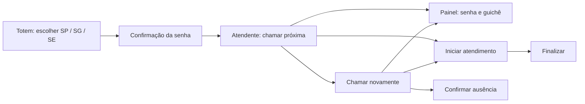
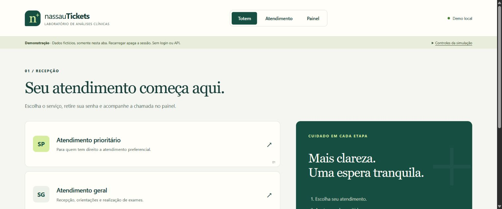
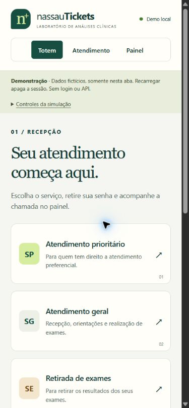

# Mockups e protótipo inicial

As três telas React são o protótipo navegável deste incremento: `/totem`, `/atendimento`, `/painel`. O fluxo usa uma única aba e dados fictícios; a prévia local é iniciada conforme o README.

## Estrutura das telas

| Tela | Composição | Estados previstos |
|---|---|---|
| Totem | Cabeçalho, três serviços, orientação lateral, confirmação da senha | Inicial, emitindo, emitida, falha, encerrado |
| Atendimento | Indicadores, guichê, senha atual, ações, totais por fila | Vazio, chamada, segunda chamada, atendimento, finalizado, ausência, falha |
| Painel | Última chamada em destaque, guichê, cinco eventos recentes | Sem chamadas, chamada, última chamada, indisponibilidade |

Este registro é a organização funcional dos mockups; capturas verificadas, quando disponíveis, ficam nesta pasta. Login, gestão e relatórios ainda precisam de protótipos próprios. Layouts responsivos definidos em frontend/src/theme/app.css.

## Capturas verificadas em 03/10/2026

Recortes do viewport do protótipo real, não mockups gerados.

