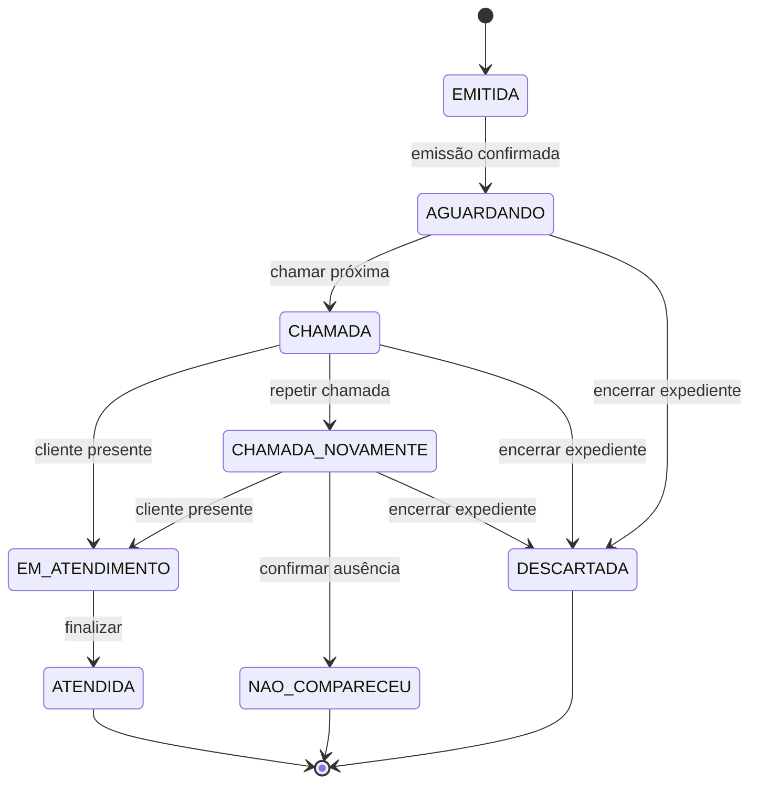

# Estados da senha — proposta inicial

O diagrama abaixo descreve o mock. As decisões sobre descarte e atendimento na primeira chamada estão documentadas nos requisitos.

NAO_COMPARECEU representa o valor NÃO_COMPARECEU usado no código. EMITIDA é transitório; não permanece em uma lista intermediária no mock.
